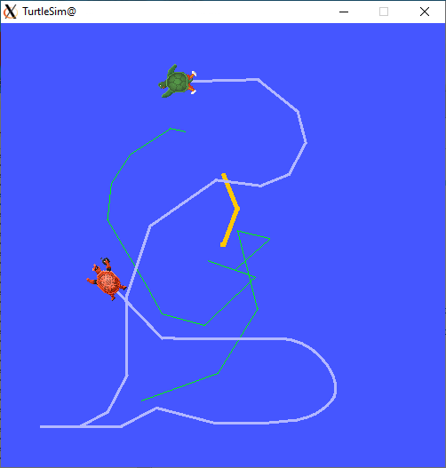

# ROS2 Client

[](https://github.com/Atostek/ros2-client/actions/workflows/static-checks.yml)
[](https://github.com/Atostek/ros2-client/actions/workflows/tests.yml)
[](https://github.com/Atostek/ros2-client/actions/workflows/tests-macos.yml)
[](https://github.com/Atostek/ros2-client/actions/workflows/audit.yml)


This is a Rust native client library for [ROS2](https://docs.ros.org/en/galactic/index.html). 
It does not link to [rcl](https://github.com/ros2/rcl), 
[rclcpp](https://docs.ros2.org/galactic/api/rclcpp/index.html), or any non-Rust DDS library. 
[RustDDS](https://github.com/jhelovuo/RustDDS) is used for communication.

The API is not identical to `rclcpp` or `rclpy`, because some parts would be very awkward in Rust. For example, there are no callbacks. Rust `async` mechanism is used instead. Alternatively, some of the functionality can be polled using the Metal I/O library.

There is a `.spin()` call, but it is required only to have `ros2-client` execute some background tasks. You can spawn an async task to run it, and retain the flow of control in your code.

Please see the included examples on how to use the various features.

## Features Status

* Topics, Publish and Subscribe ✅
* QoS ✅
* Serialization ✅ - via Serde
* Services: Clients and Servers ✅ (async recommended)
* Actions ✅ (async required)
* Discovery / ROS Graph update events ✅ (async)
* `rosout` logging ✅
* Parameters ✅
    * Parameter Services (remote Parameter manipulation) ✅
* Time support
    * ROS Time ✅
    * Simulated time support ✅
    * Steady time ✅
* Message generation: from `.msg` to `.rs`- experimental
* ROS 2 Security - experimental

## Middleware backends: DDS and Zenoh

`ros2-client` can talk to ROS 2 over either of two middleware backends,
selected at compile time with Cargo features (see
[`docs/decisions/0002-dual-backend-compile-time-feature-selection.md`](docs/decisions/0002-dual-backend-compile-time-feature-selection.md)):

* **`dds`** (default) — communicates via [RustDDS](https://github.com/Atostek/RustDDS),
  interoperating with ROS 2's default DDS RMWs (`rmw_fastrtps`, `rmw_cyclonedds`, …).
* **`zenoh`** — communicates via [Zenoh](https://zenoh.io/), mirroring the wire
  protocol of the official [`rmw_zenoh`](https://github.com/ros2/rmw_zenoh)
  middleware, so it interoperates with ROS 2 nodes running `rmw_zenoh`.

Both may be enabled in the same build (ADR-0002 / ADR-0010 Phase 5); the build
only emits a `compile_error!` if **neither** is active. The default build uses
`dds`. Build the Zenoh backend with:

```console
cargo build --no-default-features --features zenoh
```

Run the bundled Zenoh example (a self-contained talker + listener over
loopback):

```console
cargo run --no-default-features --features zenoh --example zenoh_demo
```

#### Feature matrix

| Build | Entity API | Notes |
| ----- | ---------- | ----- |
| `--features dds` (default) | `ros2_client::{Context, Node, Publisher, …}` **and** `ros2_client::dds::{…}` | Same types, two paths — crate root is a convenience alias. |
| `--no-default-features --features zenoh` | `ros2_client::{Context, Node, Publisher, …}` **and** `ros2_client::zenoh::{…}` | Same, for the Zenoh entity API. |
| `--features dds,zenoh` | `ros2_client::dds::{Context, Node, …}` **and** `ros2_client::zenoh::{Context, Node, …}` only | Crate-root re-exports are suppressed (they would collide); use the namespaced modules explicitly. |

Shared, backend-neutral types — `QosProfile`, `NodeOptions`, the owned error
types, `MessageInfo`, `Gid`, `RmwRequestId`, the `graph`/discovery types, `Log`
— are always at the crate root, regardless of which backend(s) are enabled.

`ros2_client::dds::rustdds` re-exports the whole RustDDS crate at the version
`ros2-client` uses (this used to be `ros2_client::rustdds`; it moved under
`dds` in ADR-0010 Phase 5 to avoid colliding with the `zenoh` module on a
dual-backend build). Similarly, `dds::Context::domain_participant` /
`from_domain_participant` and `zenoh::Context::session` are the two backends'
raw middleware-handle escape hatches.

#### `rosout!` logging on dual-backend builds

The [`rosout!`](https://wiki.ros.org/rosout) macro is backend-specific under
the hood (`RosoutRaw::rosout_raw` on DDS vs. `Logger::log_at` on Zenoh) and is
only defined when **exactly one** of `dds` / `zenoh` is enabled — with both
enabled there is no single unambiguous `rosout!` to export. On a dual-backend
build, call the underlying method directly instead:

```rust,ignore
// DDS
ros2_client::dds::RosoutRaw::rosout_raw(&node, ros2_client::builtin_interfaces::Time::now(),
  ros2_client::ros2::LogLevel::Info, node.fully_qualified_name(), "message", file!(), "fn", line!());
// Zenoh
logger.log_at(ros2_client::ros2::LogLevel::Info, "message", file!(), "fn", line!());
```

### QoS (API convergence Phase 1)

As of 0.11, topic/service/action create APIs take the owned
[`QosProfile`](src/qos.rs) type on **both** backends (not `rustdds::QosPolicies`).
Use `QosProfile::subscription_default()` / `publisher_default()` (also exported
as `DEFAULT_SUBSCRIPTION_QOS` / `DEFAULT_PUBLISHER_QOS`) and the builder-style
setters. See [ADR-0010](docs/decisions/0010-converge-api-surfaces.md).
`ros2::QosPolicies` remains re-exported temporarily as an escape hatch.

### Metadata and discovery (API convergence Phase 2)

Breaking renames / types in 0.11 (both backends where applicable):

* `MessageInfo`: use `publisher_gid()`, `source_timestamp()`,
  `sequence_number()`, etc. (no `writer_guid` / Zenoh-only `source_gid()`).
* `RmwRequestId.writer_gid` (was DDS `writer_guid` / Zenoh `[u8; 16]`).
* `Log.stamp` and `ParameterEvent.stamp` are `builtin_interfaces::Time`
  (not `rustdds::Timestamp`; field was previously `timestamp` on some DDS
  paths).
* Discovery: match `NodeEvent::Graph(GraphEvent::…)` instead of
  `NodeEvent::DDS(DomainParticipantStatusEvent::…)`.
  `Context::discovered_topics()` returns owned `DiscoveredTopic` summaries.

See [ADR-0010](docs/decisions/0010-converge-api-surfaces.md).

### Errors (API convergence Phase 3)

Public create/read/write/wait/service APIs return owned
[`CreateError`](src/error.rs) / `ReadError` / `WriteError` / `WaitError` /
`ServiceError` (and matching `*Result` aliases) on **both** backends — not
`rustdds::dds::*` or `zenoh::Result`. `ros2::WriteError` etc. re-export the
owned types. Match portable variants such as `WriteError::WouldBlock`;
unclassified backend failures use `Middleware { reason }`.

See [ADR-0010](docs/decisions/0010-converge-api-surfaces.md).

### Entity API parity (API convergence Phase 4)

In 0.11:

* `NodeOptions` is one shared, always-compiled builder
  ([`src/node_options.rs`](src/node_options.rs)) used by **both** backends.
  Zenoh now honors `enable_rosout` / `read_rosout` /
  `start_parameter_services` (on by default) / `declare_parameter`, creating
  an optional rosout `Logger` / `/rosout` reader / `ParameterServer` at node
  construction; `Node::logger()` / `rosout_subscription()` /
  `parameter_server()` getters expose those (unsupported fields like
  `cli_args` are no-ops, logged once at `debug`). Because this wiring can
  fail, `Context::new_node` now returns `CreateResult<Node>` on Zenoh (it was
  previously infallible).
* Zenoh `Subscription::async_stream()` — same shape as the DDS
  `Subscription::async_stream()` (a `FusedStream` of `(message, MessageInfo)`).
* Zenoh `Publisher::gid()` now returns the portable [`Gid`](src/gid.rs) (was a
  raw `[u8; 16]`).
* Topic-name discovery helpers on both backends' `Node`:
  `wait_for_publisher` / `wait_for_subscription` /
  `publisher_count` / `subscription_count`, plus a `graph_event_stream()`
  yielding [`GraphEvent`](src/graph.rs)s. On DDS these are best-effort (see
  doc comments): they match by mangled topic name via RustDDS's discovered
  writers/readers, separately from the exact GUID-keyed helpers
  `Publisher`/`Subscription` already used internally.
* `Publisher`/`Subscription` gained `get_subscription_count` /
  `wait_for_subscription` and `get_publisher_count` / `wait_for_publisher` on
  the Zenoh backend, taking `&Node` — mirroring the DDS helpers in
  [`src/pubsub.rs`](src/pubsub.rs).

Service and action entity generics are now aligned across DDS and Zenoh:
`Client<Req, Resp>`, `Server<Req, Resp>`, `ActionClient<G, R, F>`, and
`ActionServer<G, R, F>`. The historical `Service`, `AService`, `ActionTypes`,
and `Action` bundle APIs were removed. Type names are supplied explicitly at
creation:

```rust
node.create_client::<MyRequest, MyResponse>(
  ServiceMapping::Enhanced, // DDS-only
  &service_name,
  &ServiceTypeName::new("my_package", "MyService"),
  request_qos,
  response_qos,
)?;

node.create_action_client::<MyGoal, MyResult, MyFeedback>(
  ServiceMapping::Enhanced, // DDS-only
  &action_name,
  &ActionTypeName::new("my_package", "MyAction"),
  action_qos,
)?;
```

Migration is direct: replace `AService<Req, Resp>` generic arguments with
`Req, Resp`, and replace an `Action<G, R, F>` descriptor argument with the
three payload type arguments `G, R, F`. Zenoh uses the same generic arity,
without DDS-only `ServiceMapping` or DDS QoS arguments.

See [ADR-0010](docs/decisions/0010-converge-api-surfaces.md).

### Escape hatches and dual-backend builds (API convergence Phase 5)

In 0.11, `dds` and `zenoh` may both be enabled in the same build —
see "Middleware backends: DDS and Zenoh" above for the feature matrix and
`rosout!` caveat. `ros2_client::dds::rustdds` re-exports RustDDS (moved from
the crate root); `dds::Context::domain_participant` /
`from_domain_participant` and `zenoh::Context::session` are the raw
middleware-handle escape hatches.

See [ADR-0010](docs/decisions/0010-converge-api-surfaces.md).

### Zenoh router requirement

Like `rmw_zenoh`, the Zenoh backend discovers peers and exchanges the ROS graph
through Zenoh's infrastructure. For anything beyond a single process you
normally run a **Zenoh router** (`zenohd`), exactly as `rmw_zenoh` does, or
configure explicit peer `connect`/`listen` endpoints. The in-process examples
and tests connect two peers directly over loopback, so they need no router. See
[`docs/decisions/0009-zenoh-router-and-config.md`](docs/decisions/0009-zenoh-router-and-config.md)
for configuration details.

### Feature support on the Zenoh backend

| Capability | Zenoh backend | Notes |
| ---------- | :-----------: | ----- |
| Topics (publish/subscribe) | ✅ | CDR payload + `(seq, timestamp, gid)` attachment, per `rmw_zenoh` |
| Services (client/server)   | ✅ | Zenoh queryable / get |
| Actions                    | ✅ | Composed of services + a feedback topic, as in ROS 2 |
| Parameters + `parameter_events` | ✅ | Six `rcl_interfaces` services + events topic |
| `rosout` logging           | ✅ | `/rosout` publisher + optional reader |
| Discovery / ROS graph      | ✅ | Zenoh liveliness tokens + a graph cache |
| QoS                        | ⚠️ | Backend-neutral profile carried in liveliness keys; not all policies enforced |
| ROS 2 Security             | ❌ | DDS-only (RustDDS security) |
| Message generation (`msggen`) | ✅ | Backend-neutral |

The design, the `rmw_zenoh` mapping, and the wire-format details are documented
under [`docs/zenoh_study/`](docs/zenoh_study/); the design decisions are recorded
under [`docs/decisions/`](docs/decisions/). To validate interoperability against
a real ROS 2 + `rmw_zenoh` stack, follow
[`docs/zenoh_study/interop_runbook.md`](docs/zenoh_study/interop_runbook.md).

> **Type hashes (send direction):** REP-2016 `RIHS01_…` type hashes are emitted
> from a table of known interop types; types outside that table use a wildcard
> on receive and a placeholder on send. Computing hashes from parsed IDL is a
> tracked post-MVP follow-up (ADR-0007).

## ROS 2 Releases Compatibility

This is what is expected to work. There are no routine tests against older releases.

Select the target distribution with a Cargo feature. 

Note: The distribution features
form a chain (`galactic` < `humble` < `iron` < `jazzy` < `kilted` < `lyrical`), and enabling
any of these also enables all the older features, 
but the build aims to be compatible only with the latest enabled.

The default feature is currently  `jazzy`, because it has LTS status. 
Build against a specific
distribution with, e.g., `cargo build --no-default-features --features humble`
(`--no-default-features` avoids also pulling in the default). 

| ROS 2 Release | `ros2-client` should interoperate? |
| ------------- | :------------ |
| A - E         | Maybe. Not tested. |
| Foxy, Galactic, Humble | Yes. Build with feature `galactic` or `humble` (older Gid format). |
| Iron  | Yes. Not well tested. Build with feature `iron`. |
| Jazzy | Yes (default). Build with feature `jazzy`. |
| Kilted | Yes. Build with feature `kilted`. |
| Lyrical | Yes. Build with feature `lyrical`. |


Please see [test results](interop/results) for details.  

## Version 0.11

**API breakage.** 0.11 replaces RustDDS types in the public API with owned ROS
types, on both backends. Code written against 0.10 will not compile unchanged.
Details are in the sections above and in
[ADR-0010](docs/decisions/0010-converge-api-surfaces.md).

* Create APIs take `QosProfile`, not `rustdds::QosPolicies`. A Reliable
  publisher must say what happens when the send window is full:
  `WhenFull::Fail`, `WhenFull::Wait(duration)`, or `WhenFull::Block`
  (shorthand: `.reliability_reliable(WhenFull::…)` /
  `.reliability_best_effort()`).
* Create/read/write/wait/service APIs return owned `CreateError`, `ReadError`,
  `WriteError`, `WaitError`, and `ServiceError`, not `rustdds::dds::*`.
* `MessageInfo`, `RmwRequestId`, and `Gid` are owned types. `Log.stamp` and
  `ParameterEvent.stamp` are `builtin_interfaces::Time`.
* Discovery is `NodeEvent::Graph(...)`. `NodeEvent::DDS` is removed.
* `Service`, `AService`, `ActionTypes`, and `Action` bundle generics are
  removed. Use `Client<Req, Resp>` and `ActionClient<G, R, F>` (Zenoh uses the
  same generics, without DDS-only `ServiceMapping`).
* `Node::status_receiver()` returns `Option`: `None` when no Spinner is
  running. It used to panic.
* `ros2_client::rustdds` moved to `ros2_client::dds::rustdds`. With both `dds`
  and `zenoh` enabled, entity types exist only under `dds::` and `zenoh::`.

Also in 0.11: an experimental Zenoh backend (Cargo feature `zenoh`),
interoperable with `rmw_zenoh`; Rust edition 2024 (MSRV 1.88); RustDDS 0.14.

## Version 0.10
* Add interoperability tests and results.
* ROS 2 distribution selection via a feature (`galactic` .. `lyrical`; default `jazzy`). 
* `Context` now checks the `ROS_DISTRO` environment variable against the compiled distribution.
* Upgrade to RustDDS 0.13 to improve interoperability.


## Version 0.9
* Upgrade to RustDDS 0.12, which had an API change.


## Version 0.8:
* API change: `ParameterFunc` must now implement `Sync`, so that `Node` is also `Sync`. This helps in using multithreaded async executors.

### Version 0.8.1:
* `AsyncActionServer` methods changes from taking `&mut self` into `&self` for better serving
concurrent goals.
* Bump RustDDS and other depencency versions
* Add example `concurrent_action_server`
* `msggen` logging can be redirected.
* Additional unit tests, including the use of `tokio` async executor.

## New in Version 0.7:
* `NodeName` namespace is no longer allowed to be the empty string, because it confuses ROS 2 tools. Minimum namespace is "/".
* Parameter support, incl. Paramater services
* Time support

### 0.7.1
* Subscribers can `take()` samples with deserialization "seed" value. 
This allows more run-time control of deserialization. Upgrade to RustDDS 0.10.0.

### 0.7.2
* Adapt to separation of CDR encoding from RustDDS.

### 0.7.4
* Implement std `Error` trait for `NameError` and `NodeCreateError`
* Async `wait_for_writer` and `wait_for_reader` results now implement `Send`.

### 0.7.5
* New feature `pre-iron-gid`. The Gid `.msg` definition has changed between ROS2 Humble and Iron. `ros2-client` now uses the newer version by default. Use this feature to revert to the old definition.

## New in Version 0.6:

* Reworked ROS 2 Discovery implementation. Now `Node` has `.status_receiver()`
* Async `.spin()` call to run the Discovery mechanism.
* `Client` has `.wait_for_service()`
* New API for naming Nodes, Topics, Services, Actions, and data types for Topics, Actions, and Services. The new API is more structured to avoid possible confusion and errors from parsing strings.

## New in version 0.5:

* Actions are supported
* async programming interface. This should make a built-in event loop unnecessary, as Rust async executors sort of do that already. This means that `ros2-client` is not going to implement a call similar to  [`rclcpp::spin(..)`](https://docs.ros.org/en/rolling/Concepts/Intermediate/About-Executors.html).

## Example: minimal_action_server and minimal_action_client

These are re-implementations of [similarly named ROS examples](https://docs.ros.org/en/iron/Tutorials/Intermediate/Writing-an-Action-Server-Client/Cpp.html). They should be interoperable with ROS 2 example programs in C++ or Python.

To test this, start a server and then, in a separate terminal, a client, e.g.

`ros2 run examples_rclcpp_minimal_action_server action_server_member_functions`
and
`cargo run --example=minimal_action_client`

or

`cargo run --example=minimal_action_server`
and
`ros2 run examples_rclpy_minimal_action_client client`

You should see the client requesting for a sequence of Fibonacci numbers, and the server providing them until the requested sequence length is reached.

## Example: turtle_teleop

The included example program should be able to communicate with out-of-the-box ROS2 turtlesim example.

Install ROS2 and start the simulator by ` ros2 run turtlesim turtlesim_node`. Then run the `turtle_teleop` example to control the simulator.



Teleop example program currently has the following keyboard commands:

* Cursor keys: Move turtle
* `q` or `Ctrl-C`: quit
* `r`: reset simulator
* `p`: change pen color (for turtle1 only)
* `a`/`b` : spawn turtle1 / turtle2
* `A`/`B` : kill turtle1 / turtle2
* `1`/`2` : switch control between turtle1 / turtle2
* `d`/`f`/`g`: Trigger or cancel absolute rotation action.

## Example: ros2_service_server

Install ROS2. This has been tested to work against "Galactic" release, using either eProsima FastDDS or RTI Connext DDS (`rmw_connextdds`, not `rmw_connext_cpp`). 

Start server: `cargo run --example=ros2_service_server`

In another terminal or computer, run a client: `ros2 run examples_rclpy_minimal_client client`

## Example: ros2_service_client

Similar to above.

Start server: `ros2 run examples_rclpy_minimal_service service`

Run client: `cargo run --example=ros2_service_client`

## Related Work

* [ros2_rust](https://github.com/ros2-rust/ros2_rust) is closest(?) to an official ROS2 client library. It links to ROS2 `rcl` library written in C.
* [rclrust](https://github.com/rclrust/rclrust) is another ROS2 client library for Rust. It supports also ROS2 Services in addition to Topics. It links to ROS2 libraries, e.g. `rcl` and `rmw`.
* [rus2](https://github.com/marshalshi/rus2) exists, but appears to be inactive since September 2020.

## License

Copyright 2022 Atostek Oy

Licensed under the Apache License, Version 2.0 (the "License");
you may not use this file except in compliance with the License.
You may obtain a copy of the License at

    http://www.apache.org/licenses/LICENSE-2.0

Unless required by applicable law or agreed to in writing, software
distributed under the License is distributed on an "AS IS" BASIS,
WITHOUT WARRANTIES OR CONDITIONS OF ANY KIND, either express or implied.
See the License for the specific language governing permissions and
limitations under the License.

## Acknowledgements

This crate is developed and open-source licensed by [Atostek Oy](https://www.atostek.com/).
